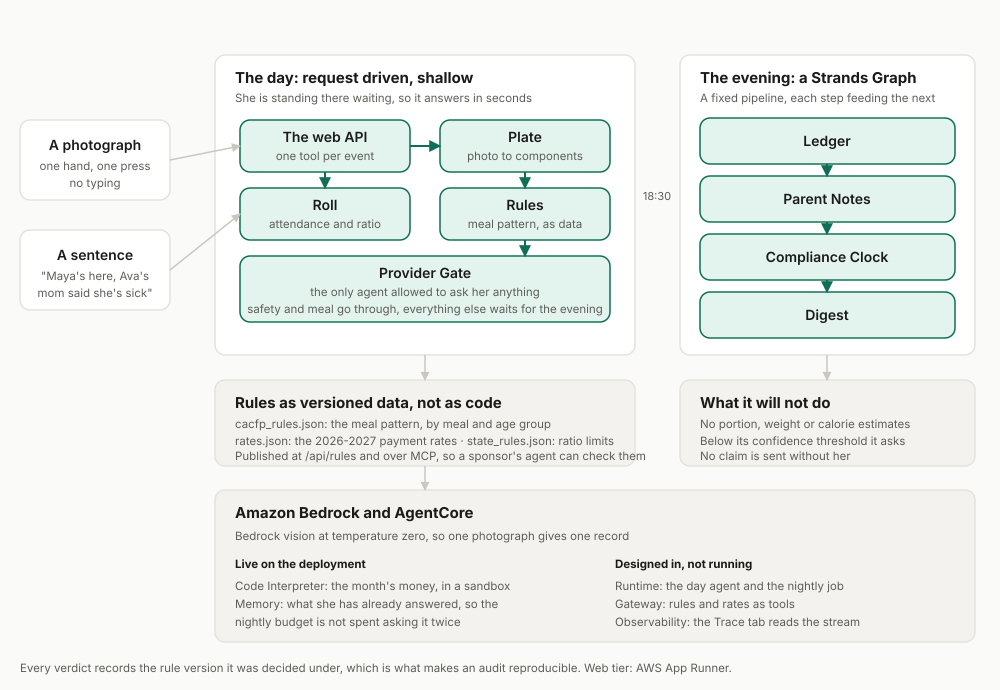

# Tally

**She feeds twelve kids and files paperwork for every bite. Tally does the counting.**

A hands-free agent for home child care providers. Photograph the plate, say who is here, and the
meal record, the attendance, the ratio check, the notes home and the monthly claim are done,
correctly, before the food is cold.

Built with the [Strands Agents SDK](https://strandsagents.com/) on
[Amazon Bedrock](https://docs.aws.amazon.com/bedrock/), deployed on AWS App Runner.
Designed for [AgentCore](https://docs.aws.amazon.com/bedrock-agentcore/), which is not wired in yet:
see Honest notes.
Submitted to the AWS Agents for Humans Hackathon, **Professional Agents** track.

---

## The problem

The paperwork happens at nine at night, and that is why it goes wrong.

A licensed family child care provider looks after four to twelve children in her own home. She is a
small business owner. To be paid for the meals she serves she must log every meal for every child by
component under the federal food program, and since 2024 she must document actual daily attendance
for every subsidised child. She does all of it after the last child goes home.

| Fact | Source |
|---|---|
| Licensed family child care homes fell 52 percent between 2005 and 2017, more than 97,000 homes. Providers serving subsidised children fell 51 percent. | [HHS Office of Child Care](https://acf.gov/occ/news/decreasing-number-family-child-care-providers-united-states) |
| Almost 80 percent of state agencies name burdensome paperwork as the top barrier to food program participation. | [American Journal of Public Health, 2023](https://ajph.aphapublications.org/doi/10.2105/AJPH.2023.307473) |
| For home providers, meal documentation "frequently becomes evening responsibilities". | [PMC, 2023](https://pmc.ncbi.nlm.nih.gov/articles/PMC10733890/) |
| The sector published a report on exactly this burden on 19 August 2026, three weeks before this hackathon closed. | [National CACFP Association, "Stretched Thin"](https://www.cacfp.org/2026/08/19/stretched-thin-the-administrative-burden-of-the-cacfp-in-family-child-care-homes/) |
| One lunch a day that fails the log, for six children, over 22 serving days, is **436.92 dollars** gone in a month at this year's tier 1 rate of 3.31 dollars. | [USDA payment rates, July 2026 to June 2027](https://www.fna.usda.gov/cacfp/reimbursement-rates) |

That last row is asserted by a test, not by prose: see `tests/test_claim.py`.

## What it does

1. **Say who is here.** "Maya's here, Leo's here, Ava's mom said she's sick, Mateo's coming at
   eight." Attendance, the subsidy check, and the ratio for the rest of the day, from one sentence.
2. **Photograph the plate.** The agent names each food and maps it to a CACFP component, then the
   rules decide whether the meal is reimbursable for every age group at the table.
3. **Fix it at the table.** "Add milk and this breakfast qualifies." Not a rejection next month,
   when nothing can be done about it.
4. **Allergies are checked before anything is written.** In the demo this catches peanut butter in a
   bowl of porridge, on a real photograph, which nobody planned.
5. **In the evening**, a Strands Graph closes the day, drafts a note home for each child in their
   family's language, checks the compliance clock, and puts at most two questions to her.

## Two things it deliberately will not do

**It does not estimate portions.** Recent evaluations put vision-language food *recognition* around
88 percent while portion and nutrient estimation remains imprecise. The food program reimburses on
components, not grams. So Tally uses the half of the problem these models are good at, and says so
rather than quietly overreaching.

**It does not guess when unsure.** Below a confidence threshold an item is left out of the record and
one question is asked instead. Guessing a component into compliance would create a false claim, which
is far worse for a provider than being asked whether the cup is milk or juice.

## Architecture



The day and the evening are different problems, so they have different shapes.

**During the day** the provider is standing there with a plate in her hand, so the work is request
driven and shallow: a Day Orchestrator receives one photograph or one sentence and calls a single
specialist agent as a tool.

**In the evening** the work is a fixed pipeline whose steps feed each other, so it is a
**Strands `Graph`**: Ledger, then Parent Notes, then Compliance, then the Digest, in that order.

This is deliberately a different Strands shape from [Turnout](../turnout), the other submission,
which uses a conditional `Graph` and the Agent-to-Agent protocol. Two problems, two shapes.

### Where the intelligence is, and is not

| Concern | How it is done | Why |
|---|---|---|
| What food is on the plate | Bedrock vision, temperature 0 | Only a model can do this, and 0 means one photograph gives one record |
| Whether the meal is reimbursable | Deterministic code against versioned JSON | Money and audits. The same plate must always get the same answer, and a year later it must be reproducible |
| The smallest fix | Computed, not generated | It has to name a food she actually has |
| Claim arithmetic, the daily maximum, ratio limits | Plain Python, unit tested | Money and licensing |
| Whether to interrupt her | Code, not a prompt | A rule a prompt can talk its way around is not a rule |

Rules and rates live in `rules/*.json` and are published at `/api/rules`, so a sponsor can check them
against the USDA tables instead of trusting the agent. Every verdict records the rule version it was
decided under.

## Run it

Needs Python 3.12 and AWS credentials with Amazon Bedrock access in `us-east-1`.

```bash
git clone <repo> && cd tally
uv venv && uv pip install -e ".[dev]"
python -m tally.data.fetch_plates    # openly licensed photographs from Wikimedia Commons
python -m tally.data.make_plates     # the two composed "after the fix" images
python -m tally.data.generate        # the demo home and day
uvicorn tally.api:app --port 8001
```

Open <http://localhost:8001> and press the steps in order.

## Bring your own lunch

This is not only a scripted demo. **`/try.html`** takes a photograph of any plate, from your camera or
your files, and returns what the food programme would say about it: the components it found with the
confidence behind each one, whether it would be paid, and the smallest change that would fix it.

A meal pattern is defined per age group, so you choose who is eating. Nothing is stored: the
photograph is read, the answer is returned, the file is deleted.

Or from your own code:

```bash
curl -X POST http://localhost:8001/api/meals \
  -H "x-api-key: tally-sandbox-2026" \
  -F "photo=@lunch.jpg" -F "meal_type=lunch" -F "age_groups=1-2,3-5"
```

Returns the components, whether the meal is reimbursable, the smallest fix if not, any questions, and
the rule version it was decided under. A meal pattern needs to know who is eating, so if nobody is
signed in and you do not pass `age_groups`, it assumes a mixed group of one to two and three to five
year olds and says so in the flags.

## Tests and evaluation

```bash
pytest -q                                   # 60 tests, no model calls, under a second
python -m evals.vision_eval --trials 2      # calls Bedrock, about two minutes
```

The deterministic logic is unit tested. The vision step is measured by an eval and the result is
committed to [docs/EVAL.md](docs/EVAL.md), so a claim about accuracy is a measurement rather than an
assertion.

**Latest run: 100 percent component recall across 13 photographs, 2 trials each, 0 spurious
components.** Six of the thirteen prompted a clarifying question, which is the confidence gate
working rather than a failure.

| Area | What is covered |
|---|---|
| Meal patterns | Every meal type, the breakfast meat-alternate substitution, the second-fruit-for-vegetable rule, snack pairs, the juice limit, infant meals, label checks |
| Claim maths | The published rates, the daily maximum picking the best allowed combination, tier 1 against tier 2, and the 436.92 dollar figure quoted on the landing page |
| Ratio | Texas limits, the afternoon look ahead, and children who are unaccounted for |
| Roll call | The demo sentence, absences with reasons, later arrivals, corrections, unknown names |
| Vision | Component recall and spurious components, per photograph, published |

## For judges

Start at the deployed URL or `http://localhost:8001`.

- **Play the day.** Eight steps, no login.
- **Today** shows each meal with its photograph, the components with their confidences, the verdict,
  and the rule version.
- **What Tally said out loud** is the spoken log, mirrored as text.
- **Children** shows allergies and subsidy status.
- **Evening** shows the questions, ranked, and the notes home.
- **Month** shows the claim and what the unpaid meals cost.
- **Agent trace** is every step, including the decision whether to interrupt.

## Honest notes

- **Rosa and every child are fictional.** The photographs are real, openly licensed pictures of real
  food from Wikimedia Commons, credited in [data/plates/ATTRIBUTION.md](data/plates/ATTRIBUTION.md).
  Testing food recognition against drawings would prove nothing.
- **Two images are composites.** There is no openly licensed photograph of "the same plate after the
  milk was added", so those two are composed from the real photographs, side by side, and the
  attribution says so.
- **Six earlier days of the month are seeded directly** rather than run through the agent, so the
  month view means something. Replaying a week of vision calls to fill a calendar would cost money
  and prove nothing. The demo day itself is entirely real.
- **Speech is text in this build.** The roll call is typed rather than spoken. The parser and the
  spoken responses are real; a microphone and Amazon Transcribe would sit in front of the same
  function, and Amazon Polly behind `runtime.say`.
- **Infant meal patterns are not modelled.** Infants follow a separate pattern by age in months, so
  Tally records their meals and explicitly declines to judge them rather than applying the wrong rule.
- **Only Texas is in the ratio table.** Adding a state means adding its table to
  `rules/state_rules.json`. An unknown state raises rather than guessing, because a wrong ratio limit
  is worse than no answer.

## Safety and limits

- It never photographs children. The camera frames the plate.
- It never submits a claim by itself.
- It never guesses a component into compliance.
- It never estimates portions or calories.
- It never asks more than two questions a day outside a safety alert or a meal that can still be
  fixed, and that budget is enforced in code.
- It never invents a rule.

## Licence

MIT. See [LICENSE](LICENSE).
