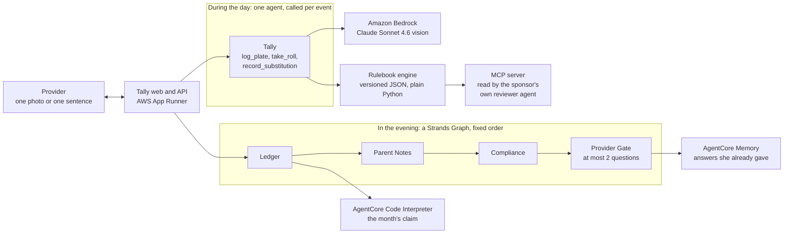

# Tally

**A hands free agent for home child care providers.** Photograph the plate, say who is here, and the
meal record, the attendance, the ratio check, the notes home and the monthly claim are done,
correctly, before the food is cold.

She feeds twelve kids and files paperwork for every bite. Tally does the counting.

| | |
|---|---|
| **Live** | <https://dtvxrkiam6.us-east-1.awsapprunner.com> (no login, press the steps in order) |
| **Track** | AWS Agents for Humans Hackathon, Professional Agents |
| **Built with** | [Strands Agents SDK](https://strandsagents.com/), [Amazon Bedrock](https://docs.aws.amazon.com/bedrock/), [Bedrock AgentCore](https://docs.aws.amazon.com/bedrock-agentcore/), [MCP](https://modelcontextprotocol.io/), AWS App Runner |
| **Measured** | 100 percent component recall on 13 demo photographs, 2 trials each, 0 spurious components in 26 readings. 35 of 45 on photographs it did not choose, and 9 of the 10 misses credited nothing rather than inventing a component. 13 of 13 adversarial cases refused, 0 of 6 legitimate ones wrongly refused. [docs/EVAL.md](docs/EVAL.md) |

---

## The problem

The paperwork happens at nine at night, and that is why it goes wrong.

A licensed family child care provider looks after four to twelve children in her own home. She is a
small business owner. To be paid for the meals she serves she must log every meal for every child by
component under the federal food program, and since 2024 she must document actual daily attendance for
every subsidised child. She does all of it after the last child goes home.

| What is true | Source |
|---|---|
| Licensed family child care homes fell 52 percent between 2005 and 2017, more than 97,000 homes. Providers serving subsidised children fell 51 percent. | [1] |
| Almost 80 percent of state agencies name burdensome paperwork as the top barrier to food program participation. | [2] |
| For home providers, meal documentation "frequently becomes evening responsibilities". | [3] |
| The sector published a report on exactly this burden on 19 August 2026, three weeks before this hackathon closed. | [4] |
| One lunch a day that fails the log, for six children, over 22 serving days, is **436.92 dollars** gone in a month at this year's tier 1 rate of 3.31 dollars. | [5] |

Full citations are in [References](#references).

That last figure is asserted by a test, not by prose. See `tests/test_claim.py`.

## What it does

1. **Say who is here.** "Maya's here, Leo's here, Ava's mom said she's sick, Mateo's coming at eight."
   Attendance, the subsidy check, and the ratio for the rest of the day, from one sentence.
2. **Photograph the plate.** The agent names each food and maps it to a CACFP component, then
   deterministic rules decide whether the meal is reimbursable for every age group at the table.
3. **Fix it at the table.** "Add milk and this breakfast qualifies." Not a rejection next month, when
   nothing can be done about it.
4. **Allergies are checked before anything is written.** In the demo this catches peanut butter in a
   bowl of porridge, on a real photograph, which nobody planned.
5. **In the evening,** a Strands Graph closes the day, drafts a note home for each child in their
   family's language, checks the compliance clock, and puts at most two questions to her.

## Two things it deliberately will not do

**It does not estimate portions.** Recent evaluations put vision language food *recognition* around 88
percent while portion and nutrient estimation remains imprecise. The food program reimburses on
components, not grams. So Tally uses the half of the problem these models are good at, and says so
rather than quietly overreaching.

**It does not guess when unsure.** Below a confidence threshold an item is left out of the record and
one question is asked instead. Guessing a component into compliance would create a false claim, which
is far worse for a provider than being asked whether the cup is milk or juice.

## How it is built



The day and the evening are different problems, so they have different shapes.

**During the day** the provider is standing there with a plate in her hand, so the work is request
driven and shallow: one agent receives one photograph or one sentence and calls a single specialist
tool.

**In the evening** the work is a fixed pipeline whose steps feed each other, so it is a Strands
`Graph`: Ledger, then Parent Notes, then Compliance, then the Digest, in that order.

This is deliberately a different Strands shape from [Turnout](https://github.com/usv240/turnout), the
other submission, which uses a conditional `Graph` and the Agent to Agent protocol. Two problems, two
shapes.

### Where the intelligence is, and is not

| Concern | How it is done | Why |
|---|---|---|
| What food is on the plate | Bedrock vision, temperature 0 | Only a model can do this, and 0 means one photograph gives one record |
| Whether the meal is reimbursable | Deterministic code against versioned JSON | Money and audits. The same plate must always get the same answer, and a year later it must be reproducible |
| The smallest fix | Computed, not generated | It has to name a food she actually has |
| Claim arithmetic, the daily maximum, ratio limits | Plain Python, unit tested | Money and licensing |
| Whether to interrupt her | Code, not a prompt | A rule a prompt can talk its way around is not a rule |

Rules and rates live in `rules/*.json` and are published at `/api/rules`, so a sponsor can check them
against the USDA tables instead of trusting the agent. Every verdict records the rule version it was
decided under.

### The sponsor does not have to trust any of that

`/api/rules` is JSON for a person to read. The organisation that actually questions a claim is the
sponsoring agency, and what reviews a claim on their side is increasingly an agent rather than a person
with a browser.

So the same rulebook is served over the **Model Context Protocol** by `mcp/server.py`, and
`mcp/sponsor.py` is a Strands agent that consumes it. That reviewer holds no Tally code. Its entire
toolset is discovered at runtime over stdio, and every answer carries the rule version it came from.

```bash
python -m tally.mcp.sponsor --check     # every tool over the real protocol, no model, no cost
```

It is read only by construction: nothing exposed can log a meal, change a rule or touch a claim.
`tests/test_mcp_rulebook.py` runs five component combinations through the MCP boundary and through
`engine/rules.py` directly and asserts the verdicts are identical, because a reviewer who disagrees
with the provider's software over the same facts is the failure this design exists to prevent.

The full inventory of which Strands surfaces are used, which were rejected and why, is in
[docs/STRANDS_SURFACES.md](docs/STRANDS_SURFACES.md).

### Which AWS services are actually running

| Service | Status | What it does here |
|---|---|---|
| Bedrock (Sonnet 4.6 vision, Haiku 4.5) | **live** | Reading the plate, parsing the roll call, drafting notes home |
| AgentCore Code Interpreter | **live** | The month's claim, computed from the same kernel file the local path imports. The screen says which one answered. |
| AgentCore Memory | **live** | The answers she has already given, so the two questions she gets each night are not spent asking the same thing twice |
| AgentCore Observability | **code path live, no collector attached** | `observability.py` exports OTLP spans, off unless `OTEL_EXPORTER_OTLP_ENDPOINT` is set. `/api/health` reports which state it is in. |
| AgentCore Runtime | designed | The web tier is App Runner today |
| AgentCore Gateway | designed | The rulebook, the roster and the claim filing as managed tools |
| App Runner | **live** | One long running container, because the demo holds shared in memory state. On Lambda, two judges pressing the same step would land on different instances holding different days. |

### What it remembers, and why that is the whole point

The Provider Gate rations her to two questions a night, enforced in code, because her attention is the
thing this product exists to protect. That budget only means anything if both questions are new.

The subsidy reconciliation question is what breaks without memory. It fires when a subsidised child is
present on a day their authorisation does not cover, and that is almost never a one off: a family whose
Tuesday is not on the paperwork has an unlisted Tuesday every week. So she answers "yes, Leo was here"
on Tuesday, and the same question arrives the next Tuesday, and the one after, each time spending one
of the two things she was going to be asked that night.

So an answer is stored against its topic, the child and the weekday, which is the thing that recurs,
rather than against a question id that is new every evening. Ask again inside 45 days and the evening
view says it already knows and when it last heard it, instead of silently dropping the question. After
that the answer ages out, because a family's schedule does change and an answer from three months ago
is not evidence about this week.

A lookup that fails asks her anyway. Failing safe here means a question repeated, not a subsidy day she
is owed and never claims.

## Run it locally

Needs Python 3.12 and AWS credentials with Amazon Bedrock access in `us-east-1`.

```bash
git clone https://github.com/usv240/tally && cd tally
uv venv && uv pip install -e ".[dev]"
python -m tally.data.fetch_plates    # openly licensed photographs from Wikimedia Commons
python -m tally.data.make_plates     # the two composed "after the fix" images
python -m tally.data.generate        # the demo home and day
uvicorn tally.api:app --port 8001
```

Open <http://localhost:8001> and press the steps in order.

`TALLY_USE_AGENTCORE=1` sends the month's arithmetic through AgentCore Code Interpreter and her
answers through AgentCore Memory. It is set on the deployed service. Without it the identical kernel
runs locally, nothing is remembered between evenings, and the screen says which answered. Create the
memory once before deploying, because provisioning takes minutes and she is standing at a table:

```bash
python -m tally.agentcore.provision          # creates it
python -m tally.agentcore.provision --list   # shows what exists
```

## Tests and checks

Everything below runs in GitHub Actions on every push. See `.github/workflows/ci.yml`.

```bash
pytest -q                         # 146 tests, no model calls, under five seconds
ruff check src tests tools        # lint
python tools/check_copy.py        # house style: no emoji, no em or en dashes, anywhere

python -m tally.mcp.sponsor --check    # the rulebook over the real MCP protocol, no model, no cost
python -m evals.vision_eval --trials 2 # calls Bedrock, about two minutes
python -m evals.refusal_eval           # 13 adversarial cases, 6 legitimate controls
python -m evals.wild_eval              # 45 photographs the project did not choose

uvicorn tally.api:app --port 8001 &
python tools/a11y_audit.py --base http://127.0.0.1:8001           # 30 page renders
python tools/a11y_audit.py --base http://127.0.0.1:8001 --play    # 54, with the demo played
python tools/dry_run.py tally http://127.0.0.1:8001      # every page, step and tab
python tools/zoom_audit.py http://127.0.0.1:8001 /,/app.html,/try.html,/start.html,/sponsor.html
                                                         # 200 and 400 percent zoom
```

The deterministic logic is unit tested. The vision step is measured by an eval and the result is
committed to [docs/EVAL.md](docs/EVAL.md), so a claim about accuracy is a measurement rather than an
assertion.

The accessibility audit loads every page in both themes at 390, 768 and 1280 pixels wide, and fails the
build on any WCAG 2.2 A or AA violation, any page that scrolls sideways, any control under its target
size, or any console error. It runs twice, because an empty page audits about a fifth of the app: the
second pass plays the demo first and then checks every tab in the populated app.

| Area | What the suite covers |
|---|---|
| Meal patterns | Every meal type, the breakfast meat alternate substitution, the second fruit for vegetable rule, snack pairs, the juice limit, infant meals, label checks |
| Claim maths | The published rates, the daily maximum picking the best allowed combination, tier 1 against tier 2, and the 436.92 dollar figure quoted on the landing page |
| Ratio | Texas limits, the afternoon look ahead, and children who are unaccounted for |
| Roll call | The demo sentence, absences with reasons, later arrivals, corrections, unknown names |
| MCP boundary | Five component combinations through the protocol and through `engine/rules.py` directly, asserted identical |
| Vision | Component recall and spurious components, per photograph, published |

## Try it with your own lunch

This is not only a scripted demo. **`/try.html`** takes a photograph of any plate, from your camera or
your files, and returns what the food programme would say about it: the components it found with the
confidence behind each one, whether it would be paid, and the smallest change that would fix it. A meal
pattern is defined per age group, so you choose who is eating. Nothing is stored: the photograph is
read, the answer is returned, the file is deleted.

**The API** is on the landing page under API, with a button that mints you a key and another that calls
every read endpoint in front of you. Read endpoints also accept the public sandbox key
`tally-sandbox-2026`, or no key at all.

```bash
curl -X POST https://dtvxrkiam6.us-east-1.awsapprunner.com/api/meals \
  -H "x-api-key: tally-sandbox-2026" \
  -F "photo=@lunch.jpg" -F "meal_type=lunch" -F "age_groups=1-2,3-5"
```

Returns the components, whether the meal is reimbursable, the smallest fix if not, any questions, and
the rule version it was decided under. A meal pattern needs to know who is eating, so if you do not
pass `age_groups` it assumes a mixed group of one to two and three to five year olds and says so in the
flags.

## What to look at

- **Play the day.** Eight steps, no login, or press "Play the rest of the day" and watch it run.
- **Today** shows each meal with its photograph, the components with their confidences, the verdict,
  and the rule version.
- **What Tally said out loud** is the spoken log, mirrored as text.
- **Children** shows allergies and subsidy status.
- **Evening** shows the questions, ranked, and the notes home.
- **Month** shows the claim and what the unpaid meals cost.
- **Agent trace** is every step, including the decision whether to interrupt.
- **`/sponsor.html`** is the same month from the other side of the desk: every meal with the photograph
  it was judged from and the rulebook version that judged it. That is what makes a claim defensible to
  a state reviewer a year later, and the same record is at `GET /api/sponsor/month`.
- **`/start.html`** takes a paste of whatever list of children you already have, in whatever shape you
  keep it, and shows what it understood plus a ratio check before anything is saved. Lines it cannot
  read are reported, never dropped.

## What it will not do

- It never photographs children. The camera frames the plate.
- It never submits a claim by itself.
- It never guesses a component into compliance.
- It never estimates portions or calories.
- It never asks more than two questions a day outside a safety alert or a meal that can still be fixed,
  and that budget is enforced in code.
- It never invents a rule.

## Honest notes

- **Rosa and every child are fictional.** The photographs are real, openly licensed pictures of real
  food from Wikimedia Commons, credited in [data/plates/ATTRIBUTION.md](data/plates/ATTRIBUTION.md).
  Testing food recognition against drawings would prove nothing.
- **The demo home has nine children in it,** which is inside the four to twelve a licensed family
  child care home may hold. "Twelve kids" in the tagline is the top of that range, not a count of
  Rosa's roster. The Children tab shows all nine, one of them an infant whose meals Tally records and
  declines to judge.
- **Two images are composites.** There is no openly licensed photograph of "the same plate after the
  milk was added", so those two are composed from the real photographs, side by side, and the
  attribution says so.
- **Six earlier days of the month are seeded directly** rather than run through the agent, so the month
  view means something. Replaying a week of vision calls to fill a calendar would cost money and prove
  nothing. The demo day itself is entirely real.
- **Speech is text in this build.** The roll call is typed rather than spoken. The parser and the spoken
  responses are real. A microphone and Amazon Transcribe would sit in front of the same function, and
  Amazon Polly behind `runtime.say`.
- **Infant meal patterns are not modelled.** Infants follow a separate pattern by age in months, so
  Tally records their meals and explicitly declines to judge them rather than applying the wrong rule.
- **Only Texas is in the ratio table.** Adding a state means adding its table to
  `rules/state_rules.json`. An unknown state raises rather than guessing, because a wrong ratio limit is
  worse than no answer.
- **`tools/check_copy.py` holds this repo to one house rule: no emoji, no em or en dashes.** For a long
  time it only checked text we wrote, not the text a model writes at request time. `src/tally/house.py`
  closes that: model output passes through `plain()` on its way to a screen. Punctuation only, nothing
  truncated or reworded, and idempotent so it is safe to apply twice.

## Deploy

```bash
python -m deploy.roles                       # the ECR access role and a scoped Bedrock instance role
aws ecr create-repository --repository-name tally --region us-east-1
aws ecr get-login-password --region us-east-1 | docker login --username AWS --password-stdin <account>.dkr.ecr.us-east-1.amazonaws.com
docker build -t tally . && docker tag tally <account>.dkr.ecr.us-east-1.amazonaws.com/tally:latest
docker push <account>.dkr.ecr.us-east-1.amazonaws.com/tally:latest
python -m deploy.apprunner                   # creates or updates the service, then waits
```

`deploy/apprunner.py` pins the service to the image **digest** currently in ECR rather than to the
`:latest` tag. Pushing a new image to the same tag does not change App Runner's image identifier, so it
treats the update as a no op and quietly keeps serving the old build.

The instance role is scoped to `InvokeModel` on the specific models and inference profiles this app
uses, not a wildcard, because a demo credential that can call anything is a bad example to ship.

## References

1. HHS Office of Child Care. "The Decreasing Number of Family Child Care Providers in the United
   States." <https://acf.gov/occ/news/decreasing-number-family-child-care-providers-united-states>
2. *American Journal of Public Health*, 2023. Administrative burden and participation in the Child and
   Adult Care Food Program. <https://ajph.aphapublications.org/doi/10.2105/AJPH.2023.307473>
3. PMC, 2023. Meal documentation practices among family child care home providers. PMC10733890.
   <https://pmc.ncbi.nlm.nih.gov/articles/PMC10733890/>
4. National CACFP Association. "Stretched Thin: The Administrative Burden of the CACFP in Family Child
   Care Homes." 19 August 2026.
   <https://www.cacfp.org/2026/08/19/stretched-thin-the-administrative-burden-of-the-cacfp-in-family-child-care-homes/>
5. USDA Food and Nutrition Service. CACFP reimbursement rates, July 2026 to June 2027.
   <https://www.fna.usda.gov/cacfp/reimbursement-rates>

Deeper documents, if you want them: [docs/EVAL.md](docs/EVAL.md) for every measurement,
[docs/STRANDS_SURFACES.md](docs/STRANDS_SURFACES.md) for the SDK inventory,
[TECHNICAL_DESIGN.md](TECHNICAL_DESIGN.md) for the full design, and
[DESIGN_SYSTEM.md](DESIGN_SYSTEM.md) for the interface tokens.

## Licence

MIT. See [LICENSE](LICENSE).
